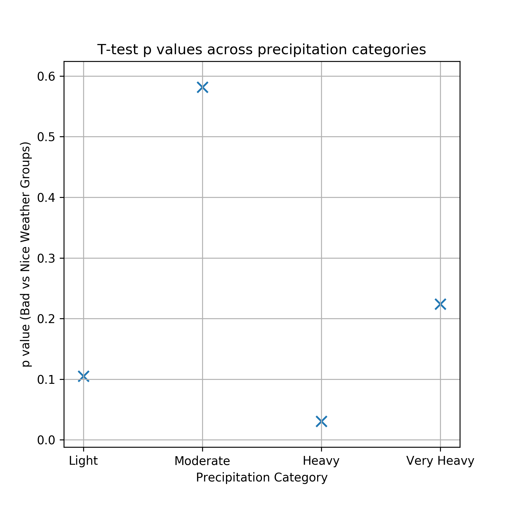
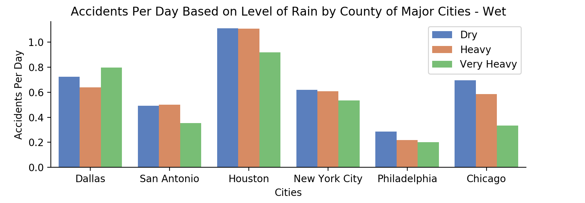
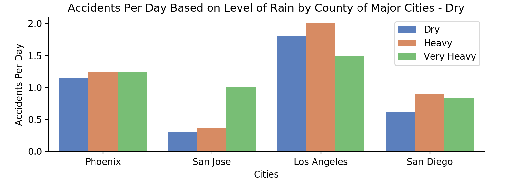

## Fatal Accident Rates vs Weather Conditions by City

For project info, head to: [Comparing City Accident Rates by Weather Condition](https://docs.google.com/document/d/1AdBdBNGvkvtY75vy4FQUB4UY7QnBio-q6RHKSfoH19I/edit?usp=sharing)

For presentation slides, head to: [Presentation](https://docs.google.com/presentation/d/1d5BogmkLREU-IEHoZFiluKGDOJVRoI5aAzpZecKThUY/edit?usp=sharing)

 - Data Collection, Cleaning, and Exploration: readAPIandFormatData.ipynb
 - Primary Data Analysis & Plotting: accidentRateAnalysis.ipynb

### Conclusion
---
This project gathered five years of weather and fatal accident data for the counties associated with the top 10 cities in the US. The goal was to investigate if particular cities performed worse (i.e., higher accident rate) in bad weather, relative to their mean accident rate on dry days. To do so, we formulated the hypothesis below:

#### Hypothesis
---
For the top 10 cities by population, cities with typically drier weather (as determined by average annual precipitation) will see a larger percentage change in fatal accident rates on rainy days than the percentage change in rates observed for typically wetter cities.

##### Findings
In three of the four precipitation categories (Light, Moderate, Very Heavy), higher p values indicate that we cannot reject the null hypothesis H0: 
 - *For the top 10 cities by population, cities with typically drier weather (as determined by average annual precipitation) do not observe a change in fatal accident rate on rainy days that is statistically different from the change in rate for cities with typically wetter weather.*

---
For the last category (Heavy: Precipitation of 0.5"-1.49"), we obtained a p-value of approximately 0.03. In this category, our wetter cities observed a mean decrease in fatal accident rate of 8.5%, while our drier cities observed a mean increase in fatal accident rate of 22.5%. 

For the case of heavy rain days, this p-value tells us that if we assume H0 to be true, there is only a 3% probability that we would observe a difference between our city groups that is at least this extreme.

We can also visualize this with our bar charts for the dry vs wet cities comparison. We note that most of the "wet" cities show an decrease in fatal accident rate on heavy precipitation days, while all of the "dry" cities show an increase in fatal accident rate. Indeed, the t-test result for this category (above) agrees with our anecdotal observation.

---

##### Original Questions:

 - *Across all selected cities, how many more accidents occur in bad weather of various types, versus in good weather?*
     - We ended up quantifying this via accident rate, and we generally found that in many of our cities, fatal accident rate decreased in worsening weather.
     - There are many potential reasons for this. For example, perhaps individuals drive slower on rainier days? 
     - One limitation of our study, though, was that our weather data only report precipitation with a 24-hour frequency. Therefore, it's possible that some of our "precipitation" days only observed rain at night, when fewer people are driving. Future work should aim to utilize more resolved precipitation data.
 - *How do the individual cities compare with each other during different weather conditions?*
     - For most categories of precipitation, our t tests suggest that there is no statistically significant difference in how fatal accident rate changes in worsening weather between our two city groups.
     - However, our p value of 0.03 suggests that, if we use a significance level of 0.05, we can reject our null hypothesis for the category of heavy precipitation.
 - *Can cities be grouped into “used to the rain” and “not used to the rain” categories?*
     - Potentially. Our p value of 0.03 suggests that under some conditions, "wet" cities may be more acclimated to driving in the rain.
     - However, to more rigorously investigate this question, there are many facets of this study that could be improved:
     
         - Increasing the number of cities in the study (perhaps taking all cities over a certain population and randomly sampling)
         - More granular precipitation data, as mentioned above
         - Include more potential features, such as population density, median age of drivers, etc. and developing regression models for each city. Then we could analyze the relative importance of each feature, including the number of rainy days.
